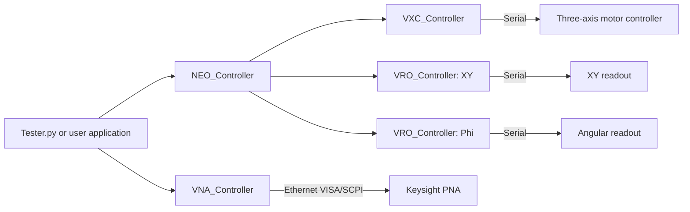

# Architecture

## Overview

NEO separates positioning hardware from instrument acquisition. The
high-level `NEO_Controller` coordinates the motor controller and position
readouts. `VNA_Controller` is currently an independent instrument driver.



There is no call from `NEO_Controller` to `VNA_Controller` in the current
code. A scan application must coordinate them itself or extend the high-level
controller after defining the desired trace-storage format.

## Repository layout

```text
.
|-- README.md
|-- Tester.py
|-- requirements.txt
|-- documentation/
|   |-- README.md
|   |-- architecture.md
|   |-- controller-api.md
|   |-- hardware-and-installation.md
|   |-- scan-data-model.md
|   |-- testing-and-troubleshooting.md
|   `-- vna-guide.md
|-- neo/
|   |-- __init__.py
|   |-- neo_driver.py
|   `-- drivers/
|       |-- __init__.py
|       |-- vna_driver.py
|       |-- vro_driver.py
|       `-- vxc_driver.py
`-- tests/
    `-- test_vna_driver.py
```

## Component responsibilities

### `neo/neo_driver.py`

Provides `NEO_Controller`, the positioning facade. It opens three serial
connections, estimates distance-per-step and angle-per-step sensitivities,
homes the axes, translates or rotates the stage, and traverses a grid in an
outward spiral.

### `neo/drivers/vxc_driver.py`

Provides `VXC_Controller`. It formats the motor-controller command language,
maps motor numbers 1, 2, and 3 to horizontal, vertical, and rotary motion, and
waits for the `^` completion character after each commanded move.

### `neo/drivers/vro_driver.py`

Provides `VRO_Controller`. One instance is used for XY readout (`type=0`) and
another for angular readout (`type=1`). It selects echo mode, reads an axis,
and sends the readout's home-setting command.

### `neo/drivers/vna_driver.py`

Provides `VNA_Controller`. It opens a PyVISA resource, identifies the PNA,
creates or selects an S-parameter measurement, configures a linear sweep,
performs a synchronized acquisition, and converts binary corrected data into
a NumPy matrix.

### `Tester.py`

Demonstrates the positioning workflow using fixed COM ports. It calibrates,
homes, performs a 5 x 5 scan at `Phi=0`, rotates to 90 degrees, performs a
second scan, returns home, and prints the arrays. It does not use the VNA.

## Connection ownership

- `NEO_Controller.connect()` constructs the motor and two readout driver
  instances and calls their `connect()` methods.
- The serial drivers construct their own `serial.Serial` objects.
- `VNA_Controller` normally constructs its own PyVISA resource manager. Tests
  or applications may inject a resource manager through the constructor.
- An injected VNA resource manager remains owned by the caller and is not
  closed by `VNA_Controller.disconnect()`.

## Error model

The code uses two error styles:

- Serial and high-level positioning methods generally print an error and
  return `False` or `None`.
- VNA `connect()` prints an error, stores the exception in `last_error`, and
  returns `False`. Other VNA methods raise `RuntimeError` or `ValueError` for
  connection, response, or argument errors.

Applications should check every connection and motion result and use
`try/finally` around connected hardware.
